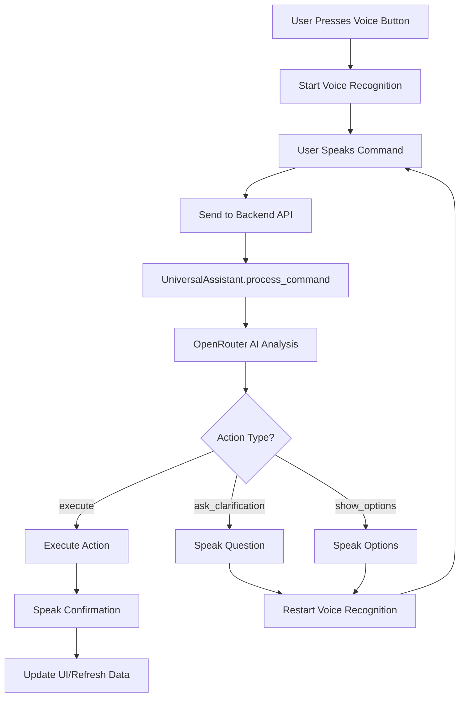

# Universal Voice Assistant Implementation Plan

## Overview

Create a single voice button that acts as a universal assistant, routing natural language commands to all existing app features. The assistant uses OpenRouter AI to understand intent and extract entities, then executes actions using existing backend functions. All follow-up questions are voice-based (not just UI).

## Architecture



## Implementation Steps

### 1. Backend: Universal Assistant Service

**File**: `backend/api/universal_assistant.py` (NEW)Create a service class that:

- Processes natural language commands via OpenRouter
- Routes to existing functions based on intent
- Returns structured responses with action types
- Handles all app features: lists, events, recipes, meal planning

**Key Methods**:

- `process_command(command: str) -> Dict`: Analyzes command and returns intent/entities
- `execute_action(intent_result: dict) -> Dict`: Executes the action using existing functions
- Helper methods for each feature type (add_item, create_event, search_recipe, etc.)

**Features to Support**:

**LISTS:**

1. **Create List**: "create a grocery list", "make a todo list called chores"
2. **Update List**: "rename grocery list to shopping", "change list name"
3. **Delete List**: "delete my grocery list", "remove the shopping list"
4. **View Lists**: "show my lists", "what lists do I have"
5. **Create List Item**: "I need creamer", "add milk to grocery list", "add eggs to shopping list"
6. **Update List Item**: "change milk to whole milk", "update eggs quantity to 12"
7. **Delete List Item**: "remove milk from list", "delete eggs", "take off creamer"
8. **Toggle Item Complete**: "mark milk as done", "complete eggs" (for grocery lists, this deletes the item)
9. **View Completed Items**: "show completed grocery items", "what did I buy last week"
10. **Create Grocery Category**: "create a category called dairy"
11. **Update Grocery Category**: "rename dairy to milk products"
12. **Delete Grocery Category**: "delete the dairy category"
13. **View Grocery Categories**: "show my grocery categories"

**EVENTS/CALENDAR:**

1. **Create Event**: "I have an appointment next Thursday at 4pm", "schedule meeting tomorrow at 2", "add dentist appointment on January 15 at 3pm"
2. **Update Event**: "change appointment time to 5pm", "move meeting to Friday", "update event title"
3. **Delete Event**: "delete appointment", "remove meeting", "cancel dentist appointment"
4. **View Events**: "show my events", "what's on my calendar", "what events do I have this week"

**RECIPES:**

1. **Create Recipe**: "create a recipe for pasta", "add new recipe"
2. **Update Recipe**: "update pasta recipe", "change recipe ingredients"
3. **Delete Recipe**: "delete pasta recipe", "remove turducken recipe"
4. **Search Recipes**: "find me a recipe for turducken", "show recipes for pasta", "search for chicken recipes"
5. **View Recipe**: "show me the pasta recipe", "open turducken recipe"
6. **Import Recipe**: "import recipe" (requires URL follow-up), "import recipe from URL"
7. **Add Recipe Ingredients to List**: "add recipe ingredients to my grocery list", "add turducken ingredients to shopping list"

**MEAL PLANS:**

1. **Create Meal Plan**: "create meal plan for this week", "plan meals for next week"
2. **Update Meal Plan**: "update this week's meal plan", "change meal plan"
3. **Delete Meal Plan**: "delete meal plan", "remove this week's meals"
4. **View Meal Plans**: "show my meal plans", "what meals are planned"
5. **Add Meal to Plan**: "add pasta to Monday dinner", "plan chicken for Tuesday lunch"
6. **Remove Meal from Plan**: "remove pasta from Monday", "delete Tuesday's lunch"

### 2. Backend: API Endpoint

**File**: `backend/api/views.py`Add new endpoint:

```python
@api_view(['POST'])
@permission_classes([IsAuthenticated])
def universal_assistant(request):
    """Universal assistant endpoint that routes commands to features."""
```

**File**: `backend/api/urls.py`Add route:

```python
path('universal-assistant/', views.universal_assistant, name='universal-assistant'),
```

### 3. Backend: Environment Configuration

**File**: `backend/.env`Add OpenRouter API key:

```javascript
OPENROUTER_API_KEY=sk-or-v1-xxxxxxxxxxxxx
```

**File**: `backend/config/settings.py`Ensure environment variable is loaded (already using `python-dotenv`).

### 4. Frontend: Universal Assistant Hook

**File**: `mobile/hooks/useUniversalAssistant.ts` (NEW)Create hook that:

- Manages voice recognition state
- Processes commands via API
- Handles voice-based follow-up questions
- Executes actions and provides voice feedback
- Manages conversation flow state

**Key Features**:

- Voice-based clarification loop (not just UI)
- Automatic voice recognition restart after questions
- State management for multi-step flows
- Integration with existing `useVoiceRecognition` hook

### 5. Frontend: Voice Button Component

**File**: `mobile/components/VoiceButton.tsx` (NEW)Single reusable voice button component:

- Shows listening/processing states
- Integrates with `useUniversalAssistant` hook
- Can be placed anywhere in the app
- Visual feedback (pulsing when listening, etc.)

### 6. Frontend: Service Integration

**File**: `mobile/services/assistantService.ts` (NEW)API service for universal assistant:

```typescript
async processCommand(command: string): Promise<AssistantResponse>
```

### 7. Integration Points

**Existing Services to Leverage**:

- `mobile/services/listService.ts` - For list operations
- `mobile/services/calendarService.ts` - For event creation
- `mobile/services/mealsService.ts` - For recipe operations
- `mobile/hooks/useVoiceRecognition.ts` - For voice input
- `mobile/utils/voiceFeedback.ts` - For voice output (speak function)

**Backend Functions to Leverage**:

- `backend/lists/models.py` - List and ListItem models
- `backend/events/models.py` - Event model
- `backend/meals/models.py` - Recipe model
- `backend/meals/importers.py` - Recipe import functionality
- `backend/api/views.py` - Existing ViewSets (EventViewSet, RecipeViewSet)

### 8. Voice-Based Follow-Up Flow

**Implementation Pattern**:

1. User says command → AI analyzes
2. If clarification needed → Speak question → Restart voice recognition
3. User responds → Process response → Continue or execute
4. If options needed → Speak options → Restart voice recognition
5. User selects → Execute action → Speak confirmation

**Example Flow**:

```javascript
User: "I need creamer"
AI: "Which list would you like to add creamer to? Grocery, Shopping, or Other?"
[Voice recognition restarts automatically]
User: "Grocery"
AI: "Added creamer to Grocery List"
```

### 9. Error Handling

- Network errors: Voice feedback "Sorry, I'm having trouble connecting"
- Invalid commands: Voice feedback "I'm not sure what you mean. Please try again."
- Missing data: Voice-based clarification questions
- API errors: Graceful degradation with voice feedback

### 10. Testing Strategy

- Test each intent type (add item, create event, etc.)
- Test voice clarification flows
- Test error scenarios
- Test with various natural language phrasings
- Verify integration with existing features

## File Structure

```javascript
backend/
  api/
    universal_assistant.py (NEW)
    views.py (MODIFY - add endpoint)
    urls.py (MODIFY - add route)

mobile/
  hooks/
    useUniversalAssistant.ts (NEW)
  components/
    VoiceButton.tsx (NEW)
  services/
    assistantService.ts (NEW)
```

## Dependencies

**Backend**:

- `requests` (already in requirements.txt)
- OpenRouter API key in environment

**Frontend**:

- Existing voice recognition (`@react-native-voice/voice`)
- Existing voice feedback (`expo-speech`)
- No new dependencies needed

## Cost Estimate

- Per command: ~500-800 tokens = $0.0005-0.001
- Single user (50 commands/day): ~$0.75-1.50/month
- Well within OpenRouter's $5/month free tier

## Success Criteria

1. Single voice button works from any screen
2. Routes commands to correct features
3. Voice-based follow-up questions (not just UI)
4. Integrates with all existing features
5. Natural language understanding works for common phrasings